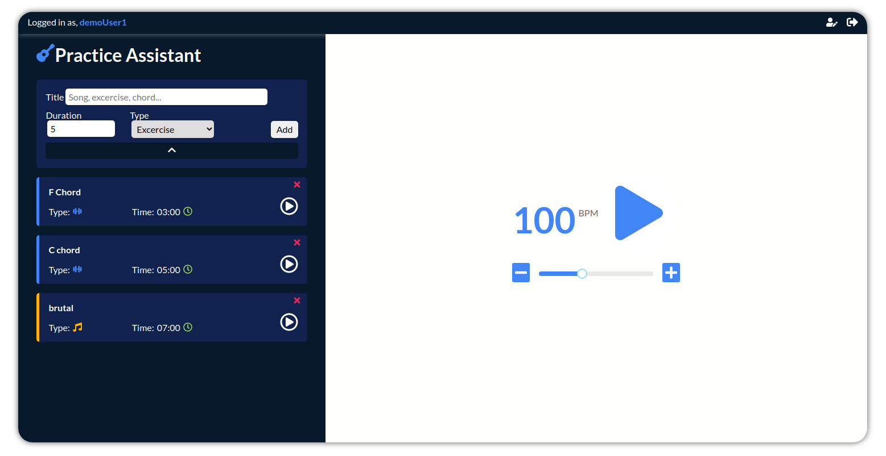

# MERN stack Guitar Practice Assistant

[Live Demo](https://guitar-pa.netlify.app/) (username: demoUser1 password: 123456Aa!)

## Intro

Started as a vanilla JS project, which turned into a full stack MERN application as I'm learning new skills and technologies. This is a practice project whrere I can learn new things and improve on my developer skillset.

## Description

The app is build with MERN stack and using RESTful API design. The client side is written in Typescript. Redux for state management, Node & Express for API, MongoDB as database. Uses JSON Web Tokens for authentication.

The app is built with a robust and easily scalable structure.

You can create new users, and log in with existing one, each user has it's own practice items which you can create, edit and delete.

## Technologies & Tools

### Front-end:

- Typescript
- React
- Redux
- Axios
- React Router
- Sass

### Backend:

- Node/Express
- MongoDB/Mongoose
